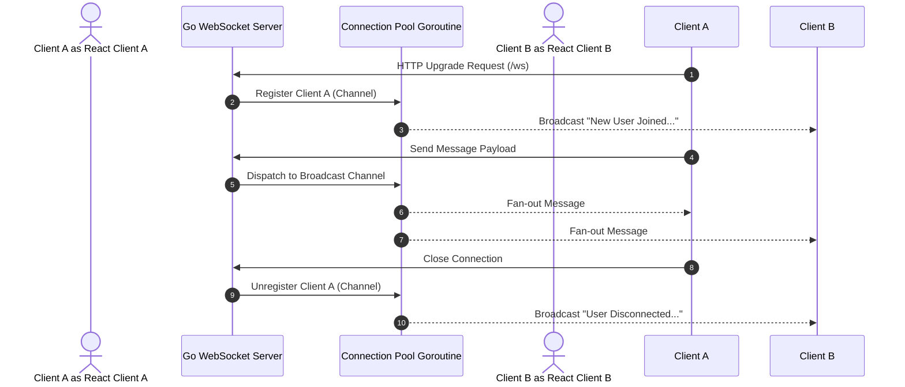

# 💬 Chatify

<p align="center">
  <b>A high-performance, real-time distributed chat application built with Go (Golang) and React.</b>
</p>

<p align="center">
  
  
  
  
</p>

---

## 📌 Overview

**Chatify** is a full-stack, real-time messaging platform designed to demonstrate modern asynchronous architecture, event-driven networking, and concurrent state synchronization. 

By leveraging **Go's low-overhead goroutines and channels** for the backend engine and **React** for an interactive single-page frontend, Chatify achieves real-time broadcast messaging with minimal resource consumption.

---

## ✨ Key Features

- **⚡ Real-Time Full-Duplex Communication**: Low-latency bidirectional messaging over persistent WebSocket connections (`wss://`).
- **🔄 Concurrent Connection Pool**: Thread-safe connection management using Go goroutines and channel-based event multiplexing.
- **📢 Dynamic Broadcast System**: Instantaneous message fan-out to all connected clients.
- **🔌 Connection Lifecycle Tracking**: Real-time notifications on user join and disconnect events.
- **🎨 Modular Frontend**: Component-driven architecture built with React and SASS.

---

## 🛠️ Tech Stack

| Layer | Technology | Key Modules / Libraries |
| :--- | :--- | :--- |
| **Backend** | Go (Golang 1.25+) | `gorilla/websocket`, `net/http` |
| **Frontend** | React 19, JavaScript (ES6+) | WebSockets API, SCSS/SASS |
| **Protocol** | WebSockets | Full-duplex TCP persistent socket |
| **Deployment** | Railway / Cloud Ready | Production WebSocket endpoint support |

---

## 🏗️ Architecture & Engineering Highlights



### 🧠 Backend Concurrency Design (Go)

The core backend architecture avoids global mutex lock contention by adhering to Go's core philosophy: *"Do not communicate by sharing memory; instead, share memory by communicating."*

1. **Thread-Safe Connection Manager (`websocket.Pool`)**:
   - Manages connection registers, unregisters, and message broadcasts via distinct, unbuffered channels (`Register`, `Unregister`, `Broadcast`).
   - Runs an isolated event-loop goroutine (`pool.Start()`) using Go's `select` statement for race-condition-free state updates.

2. **Per-Client Concurrent Read Loops (`websocket.Client`)**:
   - Spawns a lightweight goroutine for every active connection executing `client.Read()`.
   - Automatically handles socket cleanup and unregistration upon connection drops via Go's `defer`.

3. **Gorilla WebSocket Integration**:
   - Custom upgrader with configurable HTTP origin checking and memory buffer allocations (`ReadBufferSize` / `WriteBufferSize` set to 1024 bytes).

---

## 📁 Repository Structure

```
Chatify/
├── backend/                  # Go WebSocket Backend Service
│   ├── main.go               # HTTP Server & WebSocket Endpoint Setup
│   ├── go.mod / go.sum       # Go Modules and Dependencies
│   └── pkg/
│       └── websocket/        # Real-time WebSocket Package
│           ├── client.go     # Client Connection Handler & Read Loop
│           ├── pool.go       # Centralized Connection Manager & Fan-out
│           └── websocket.go  # HTTP-to-WebSocket Upgrader
│
└── frontend/                 # React Frontend Application
    ├── package.json          # Frontend Dependencies & Scripts
    ├── public/               # Static HTML & Assets
    └── src/
        ├── api/              # WebSocket API Client Configuration
        ├── components/       # Reusable UI Components
        │   ├── Header/       # Top Navigation / Title Banner
        │   ├── ChatHistory/  # Scrollable Chat Log Display
        │   ├── ChatInput/    # Message Input Bar (Enter key handler)
        │   └── Message/      # Individual Message Card Renderer
        ├── App.js            # Main React State & Lifecycle Container
        └── index.js          # React DOM Mount Entrypoint
```

---

## 🚀 Getting Started

### Prerequisites

- **Go**: `v1.20` or higher ([Download Go](https://go.dev/doc/install))
- **Node.js**: `v18.0` or higher ([Download Node.js](https://nodejs.org/))
- **npm** or **yarn** package manager

---

### 1️⃣ Run Backend (Go)

```bash
# Navigate to backend directory
cd backend

# Install Go dependencies
go mod download

# Start the WebSocket server (runs on port 8080 by default)
go run main.go
```

The Go server will start listening on `http://localhost:8080/ws`.

---

### 2️⃣ Run Frontend (React)

```bash
# Navigate to frontend directory
cd frontend

# Install node dependencies
npm install  # or: yarn install

# Start the development server
npm start    # or: yarn start
```

The application will open in your browser at `http://localhost:3000`.

---

Note the following architectural considerations:

- **Asynchronous Fan-out**: Demonstrates mastery of Go concurrency primitives (`channels`, `goroutines`, `select` loops).
- **Scalable State Handling**: React state managed cleanly with immutable array updates upon receiving WebSocket message streams.
- **Production Readiness**: Clear separation of concerns between network protocol handlers (`pkg/websocket`) and application logic (`main.go`).

---

## 📄 License

This project is licensed under the **MIT License**.

---

## 👤 Author

**3bdo-Yahya**
- GitHub: [@3bdo-Yahya](https://github.com/3bdo-Yahya)
